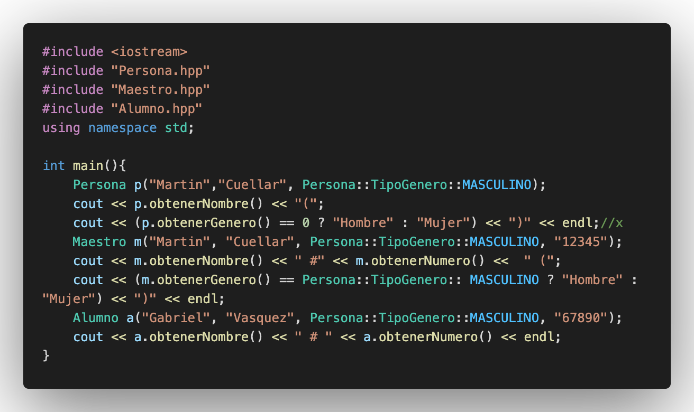

# C++ _ PDC _ #07

## :copyright: Autor

- :camera: 

- :man: **Miguel Angel Rojas Herrera**
- :e-mail: m_rojas18@unitec.edu
- :link: [github.com/m_rojas18](https://github.com/m-rojas18)
- :calendar: 2020-08-30 21:00 CST

---
## :dart: Objetivos

Punto de Control #07 en C++ mostrara: 

1. La implementación de herencia en C++

2. La implementación de polimorfismo en C++

3. Utilizacion de templates en C++

## :large_blue_circle: 1) Herencia.cpp

