# C++ _ PDC _ #07

## :copyright: Autor

- :camera: 

- :man: **Miguel Angel Rojas Herrera**
- :e-mail: m_rojas18@unitec.edu
- :link: [github.com/m_rojas18](https://github.com/m-rojas18)
- :calendar: 2020-08-30 21:00 CST

---
## :dart: Objetivos

Punto de Control #07 en C++ mostrara: 

1. La implementación de herencia en C++

2. La implementación de polimorfismo en C++

3. Utilizacion de templates en C++

## :black_large_square: 1) Herencia.cpp

## :large_blue_circle: Persona.hpp

## :large_blue_diamond: Persona.cpp
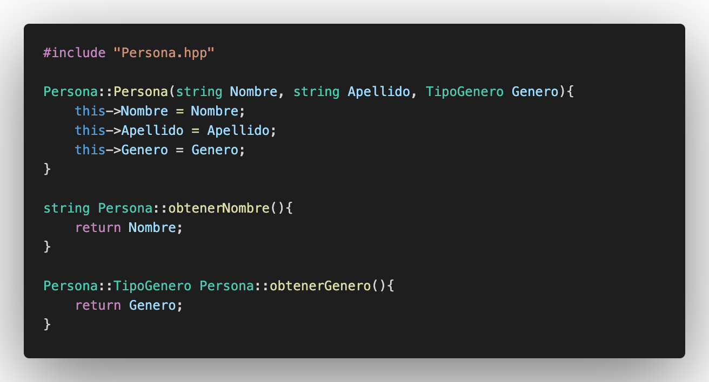

## :large_blue_circle: Maestro.hpp

## :large_blue_diamond: Maestro.cpp

## :large_blue_circle: Alumno.hpp
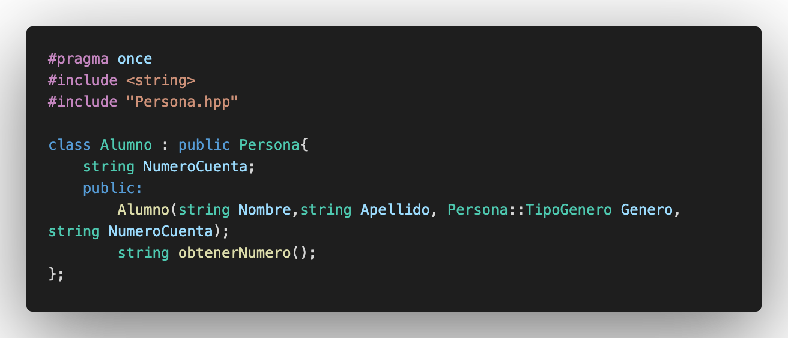

## :large_blue_diamond: Alumno.cpp
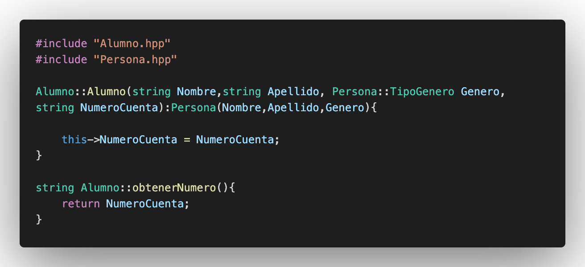

## :red_circle: Salida:
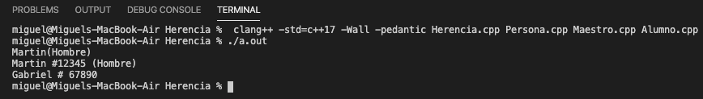

## :large_orange_diamond: Descripción:
-> El programa utiliza herencia para obtener distintor valores de las clases por medio de metodos y utiliza una comparacion en un enum para imprimir lo que busca.

## :black_large_square: 2) Polimorfismo.cpp
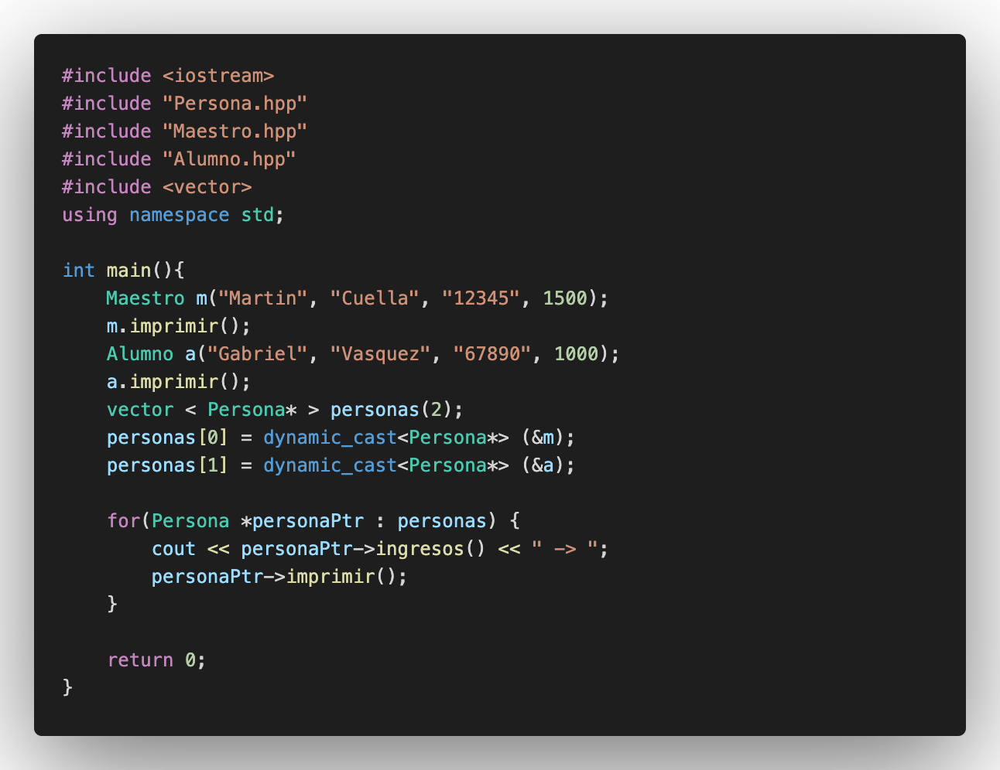

## :white_circle: Persona.hpp
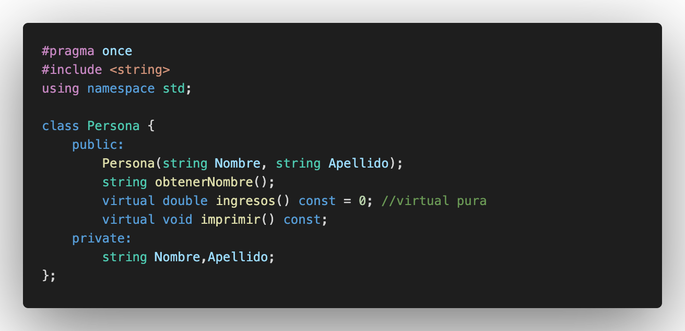

## :large_blue_diamond: Persona.cpp
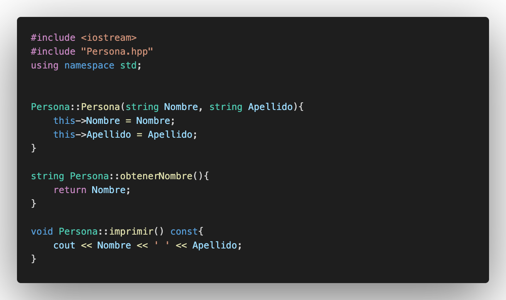

## :white_circle: Maestro.hpp
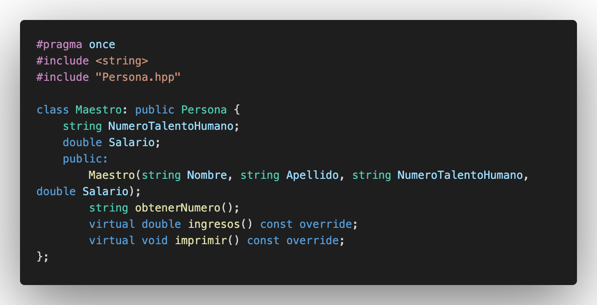

## :large_blue_diamond: Maestro.cpp
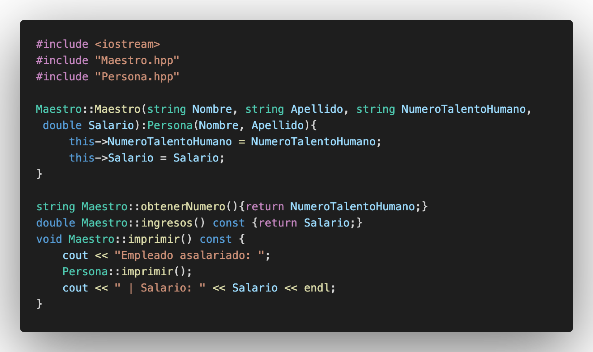

## :white_circle:Alumno.hpp
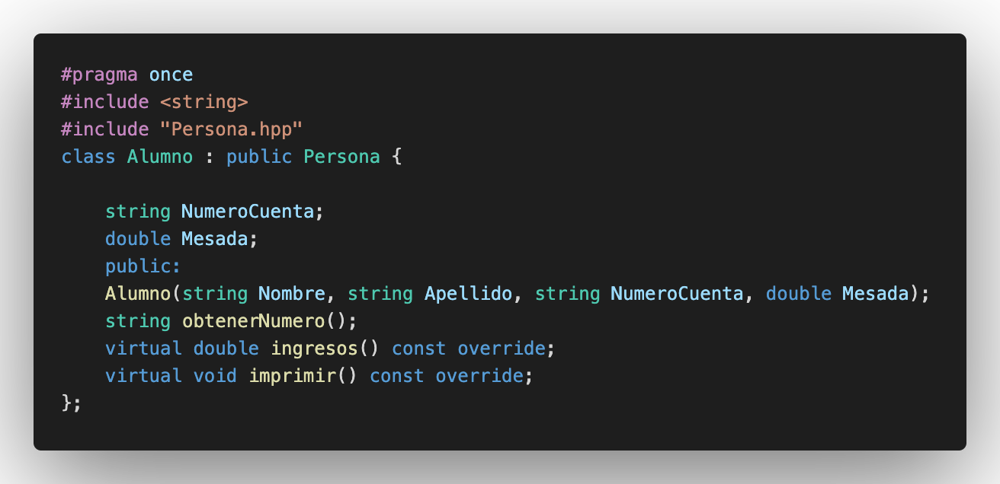

## :large_blue_diamond: Alumno.cpp
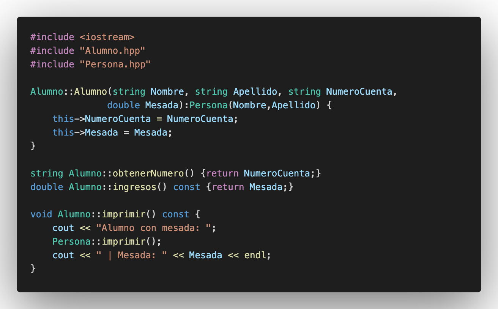

## :red_circle: Salida:
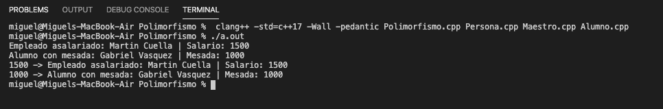

## :large_orange_diamond: Descripción:
-> El programa mediante el uso de herencia y metodos polimorficos consigue valores que tienen todos los objetos que en el caso del programa seria un valor de ingresos y un formato de impresion.

## :black_large_square: 3) Templates.cpp
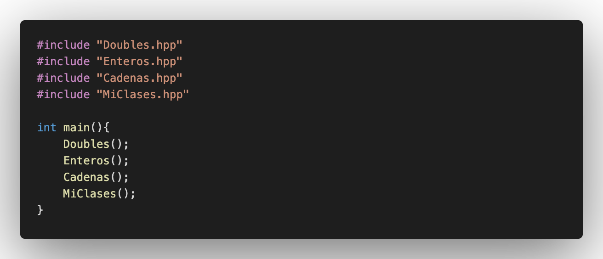

## :large_blue_circle: Cadenas.hpp
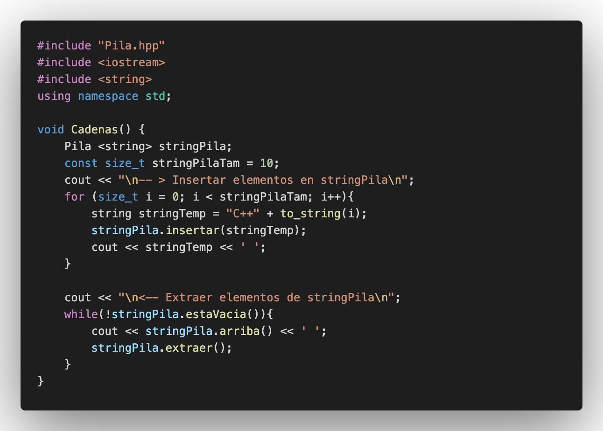

## :large_blue_circle: Doubles.hpp
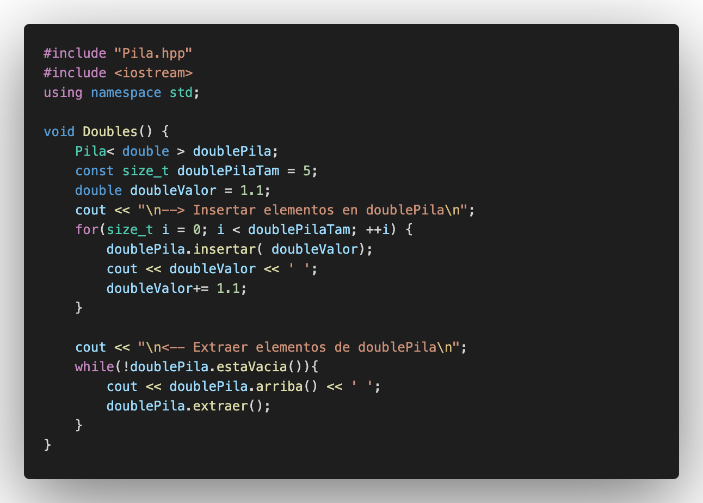

## :large_blue_circle: Enteros.hpp
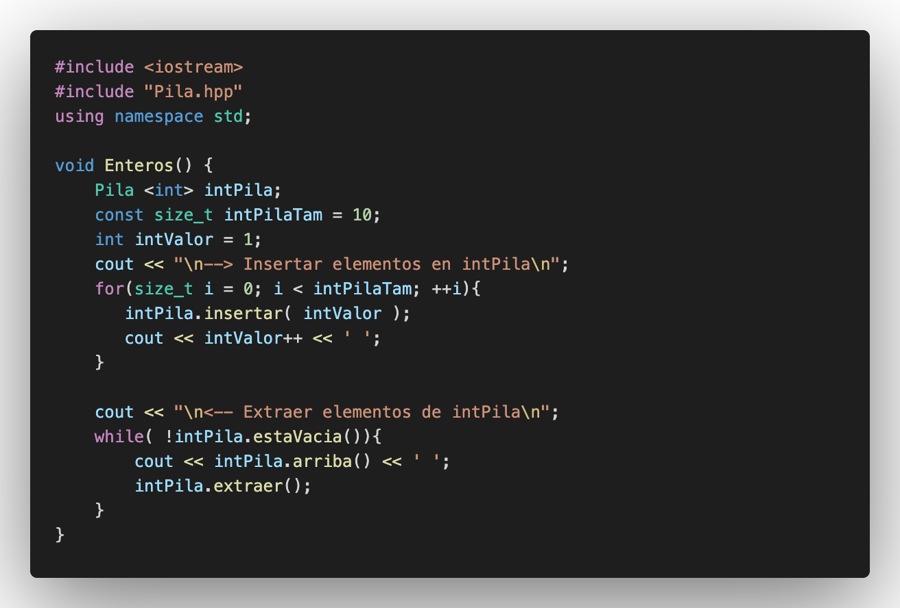

## :large_blue_circle: MiClase.hpp

## :large_blue_circle: MiClases.hpp
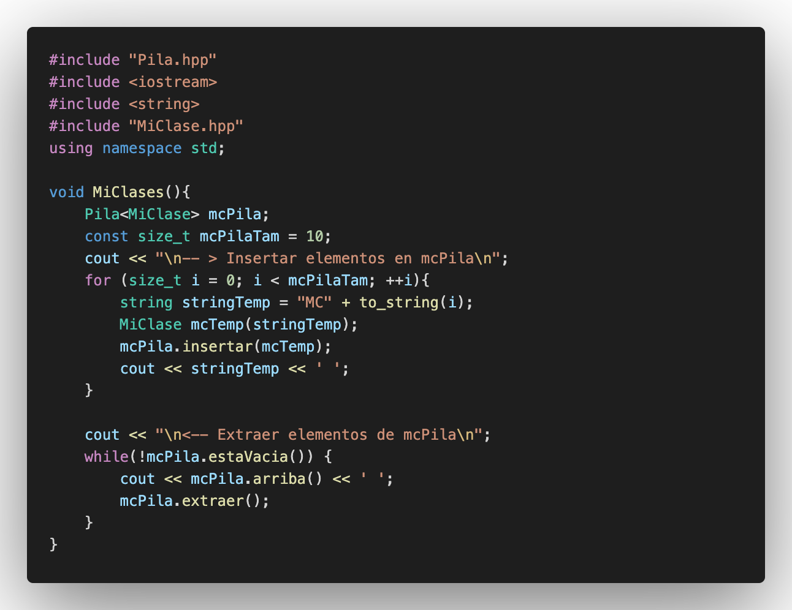

## :large_blue_circle: Pila.hpp
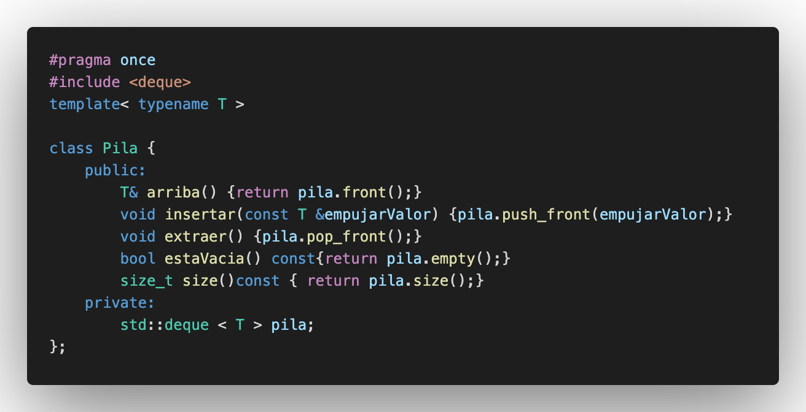

## :red_circle: Salida:
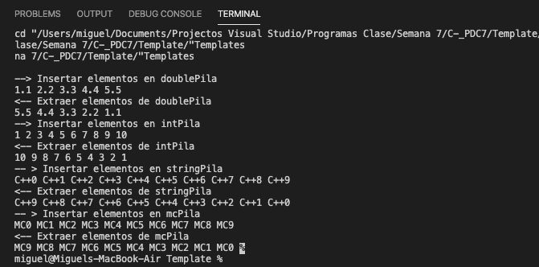

## Descripción:
->
## :computer: Código
- :blue_book: [Punto de Control #07] 
#### Herramientas:
- :package: [Visual Studio Code](https://code.visualstudio.com/)
- :camera: [Polacode-2020 v0.5.2](https://github.com/jeff-hykin/polacode)
- :notebook: [Markdown Cheatsheet](https://github.com/adam-p/markdown-here/wiki/Markdown-Cheatsheet)
- :smile: [Emoji Cheat Sheet](https://www.webfx.com/tools/emoji-cheat-sheet/)
